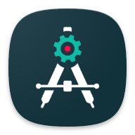

<h2 align="center">Android : Project Editor</h2>
 

  An application to efficiently and quickly manage your resources of your Android projects based on Gradle on your Android phone.

- Layout Editor (76%) 
- res/values editor 
- res/menu editor 
- Manage activity, permission, ... 
- and much more. 

<h2>Screenshots</h2>

<h2>Contact</h2>
- Telegram: https://t.me/android_pe

<h2>Thanks to</h2>
- Rosette Bikangu 
- Shibu Barman 
- Rosemoe/CodeEditor 
- Srikanth-lingala/zip4j
